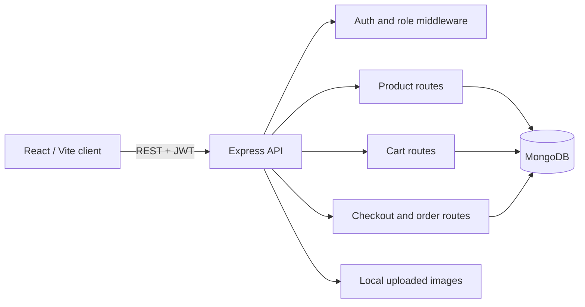
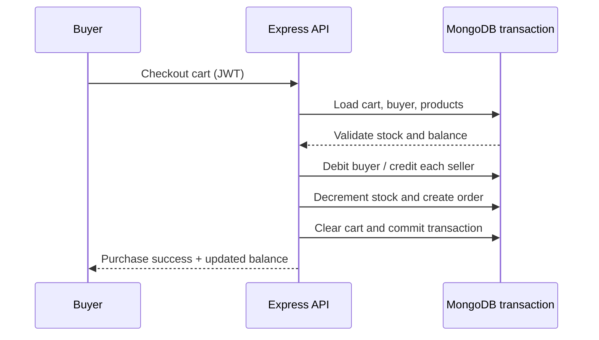
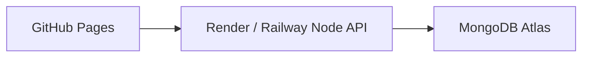

# PETALS MARKET

<p>
  
  
  
  
  
  
</p>

A focused, professional MERN marketplace for an OA evaluation. Buyers receive a $1,000 virtual balance, shop securely, and check out; sellers manage a small catalogue and receive sale proceeds.

## Highlights

- Buyer and seller registration with JWT authentication and role guards
- Secure password hashing, server-side validation, and clear API errors
- Product browsing, search, details, cart quantity controls, and optional image uploads
- Seller product creation, stock control, and sales/order visibility
- MongoDB checkout transaction: validates stock/balance, moves funds, decreases stock, creates order, and empties cart
- Money is stored as integer cents, never floating-point dollars

## Tech stack

| Layer | Technology |
| --- | --- |
| Client | React 18, Vite, React Router |
| API | Node.js, Express, REST |
| Database | MongoDB 7, Mongoose |
| Authentication | bcryptjs, JSON Web Tokens |
| Uploads | Multer local storage |
| Local infrastructure | Docker Compose |

## Architecture



## Purchase workflow



## Project structure

```text
client/                 React storefront
server/
  models/               User, Product, Cart, Order schemas
  routes/               Auth, products, cart, orders endpoints
  middleware/           JWT/role checks and error handler
  uploads/              Optional product image storage
  seed.js               Demo data seed script
docker-compose.yml      MongoDB development service
```

## Quick start

Prerequisites: Node.js 20+ (Node 24 also works), npm, and Docker Desktop.

```bash
# 1. Configure API secrets (PowerShell)
Copy-Item server/.env.example server/.env

# 2. In server/.env, replace JWT_SECRET with a long random value

# 3. Install dependencies
npm install
npm install --prefix server
npm install --prefix client

# 4. Start MongoDB (the included initializer configures a local single-node replica set)
docker compose up -d

# 5. Seed accounts and sample products
npm run seed

# 6. Start web app and API
npm run dev
```

Open `http://localhost:5173`. The API listens at `http://localhost:5000`.

## Environment variables

Create `server/.env` from the provided example. Never commit this file.

```env
PORT=5000
MONGO_URI=mongodb://localhost:27017/petals_market
JWT_SECRET=replace-with-a-long-random-secret
CLIENT_URL=http://localhost:5173
```

If you already run MongoDB through Docker on a different mapped port, set `MONGO_URI` accordingly. The supplied compose service exposes MongoDB at port 27017.

## Seed accounts

| Role | Email | Password |
| --- | --- | --- |
| Seller | `seller@petals.test` | `Petals123!` |
| Buyer | `buyer@petals.test` | `Petals123!` |

These credentials exist only for local demo data. New accounts are assigned $1,000.00 (100000 cents).

## API outline

| Endpoint | Access | Purpose |
| --- | --- | --- |
| `POST /api/auth/signup` | Public | Create buyer or seller account |
| `POST /api/auth/login` | Public | Receive JWT session |
| `GET /api/products` | Public | Browse/search catalogue |
| `POST /api/products` | Seller | Add product, optional image |
| `GET/POST/DELETE /api/cart` | Buyer | Manage cart |
| `POST /api/orders/checkout` | Buyer | Atomic purchase |
| `GET /api/orders` | Authenticated | Buyer purchases or seller sales |

## Verification checklist

1. Sign up or seed the two demo accounts.
2. Log in as seller and create a product.
3. Log in as buyer, add it to cart, and complete checkout.
4. Confirm buyer balance and product stock decrease.
5. Confirm seller balance and order history increase.

## Deployment

GitHub Pages can host the static React build, but it cannot host Express or MongoDB. A practical production arrangement is:



Before deploying, set the deployed API URL in the client, configure `CLIENT_URL` in the API host, use MongoDB Atlas, and provide a production `JWT_SECRET` through host secrets.
